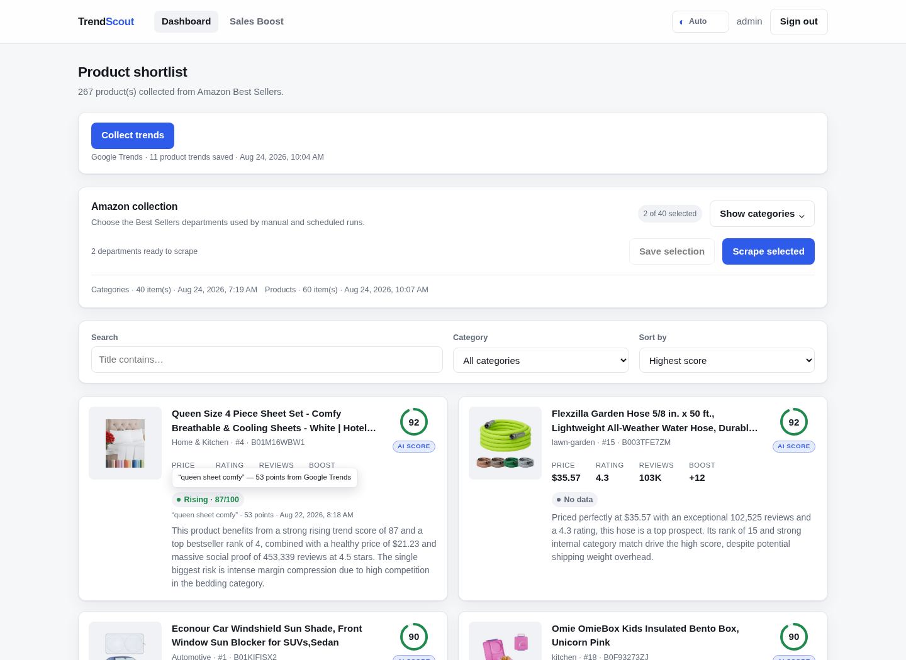
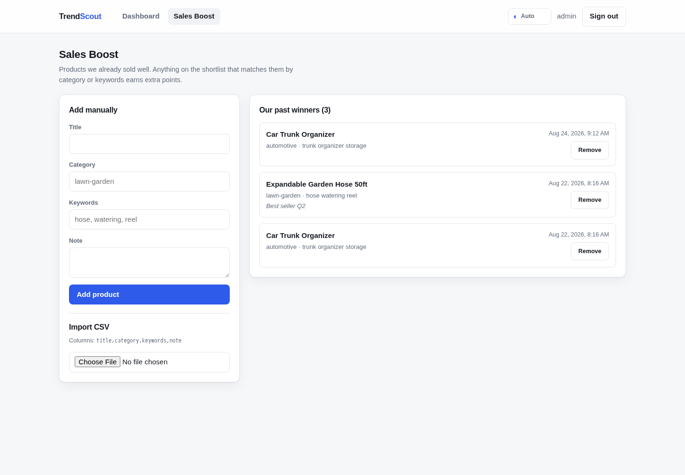
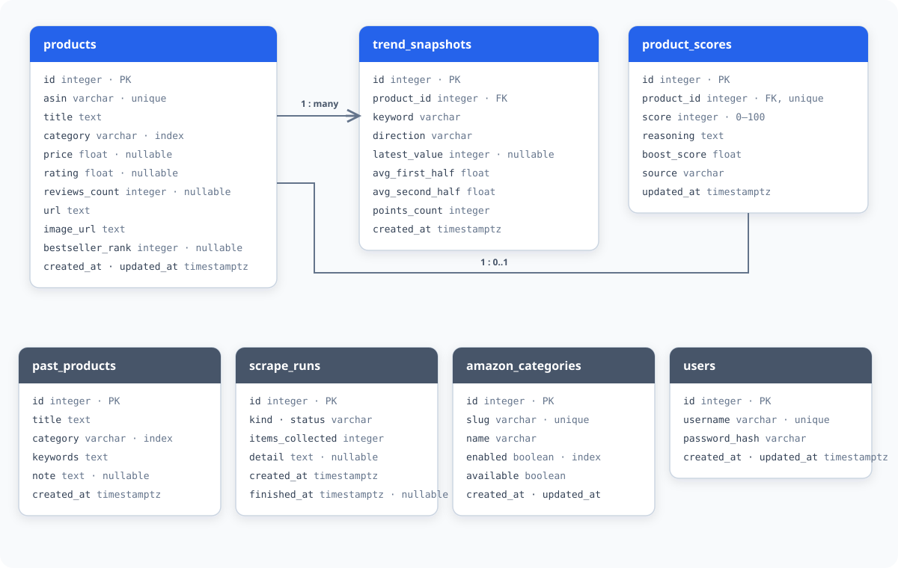

# TrendScout

Amazon product scouting for e-commerce buyers: the service scrapes Best Sellers,
reads Google Trends for each product, compares it against our own history of
successful products, and produces a **0–100 score with a written rationale** in a
dashboard — so buyers stop doing the research by hand.

```
docker compose up --build      # → http://localhost:8080  ·  admin / admin123
```

No `.env`, no migrations, no user creation — the stack comes up ready to use.

---

## Contents

- [What it does](#what-it-does)
- [Interface](#interface)
- [Architecture](#architecture)
- [Database schema](#database-schema)
- [Scoring](#scoring)
- [Running it](#running-it)
- [Configuration](#configuration)
- [Project layout](#project-layout)
- [Development](#development)
- [Engineering notes](#engineering-notes)

---

## What it does

| Capability | Where |
|---|---|
| Scrape Amazon Best Sellers with Playwright (7 required fields + bestseller rank) | `backend/app/scraping/amazon.py` |
| Discover live Amazon departments and choose them in the dashboard | `backend/app/scraping/category_service.py` |
| Read Google Trends with Playwright and store the reading | `backend/app/scraping/trends.py` |
| Internal Sales Boost from our past winners | `backend/app/scoring/boost.py` |
| LLM scoring with a deterministic fallback | `backend/app/scoring/` |
| Manual trigger from the panel + a run every 6 hours | `backend/app/tasks/` |
| Login, dashboard, Sales Boost page (CSV + manual form) | `frontend/src/features/` |
| Automatic, light and dark interface themes | `frontend/src/shared/theme.ts` |

---

## Interface

The dashboard keeps collection controls, filters, score provenance and the
written rationale together. `AI score` identifies an LLM verdict; `Formula`
shows that the deterministic fallback produced the result.



Sales Boost accepts past winners manually or from CSV and immediately uses
category and keyword matches when the catalogue is rescored. Manual entries use
the discovered Amazon category list, preventing silent mismatches between slugs
and display names.



---

## Architecture

```
                    ┌──────────────────────────────────────────┐
   browser  ───────▶│  frontend  ·  nginx + Vue 3 SPA          │
                    │  serves the app, proxies /api same-origin│
                    └───────────────────┬──────────────────────┘
                                        │ /api  (httpOnly cookie)
                    ┌───────────────────▼──────────────────────┐
                    │  api  ·  FastAPI (async)                  │
                    │  auth · products · categories · runs      │
                    │  never scrapes, never calls the LLM       │
                    └────────┬───────────────────────┬──────────┘
                             │ enqueue               │ read/write
                             ▼                       ▼
                    ┌──────────────────┐   ┌────────────────────┐
                    │  redis           │   │  postgres          │
                    │  Taskiq streams  │   │  products, trends, │
                    │  + results       │   │  scores, categories│
                    └────────┬─────────┘   └─────────▲──────────┘
             ┌───────────────┴───────────────┐       │
             ▼                               ▼       │
   ┌───────────────────┐          ┌────────────────────────┐
   │  scheduler        │          │  worker                 │
   │  cron: every 6h   │─────────▶│  Playwright (Chromium)  │
   │  → scrape_amazon  │          │  scrape → trends → score│
   └───────────────────┘          └───────────┬─────────────┘
                                              │ batched requests
                                              ▼
                                   ┌────────────────────────┐
                                   │  LLM provider          │
                                   │  Gemini/Claude/OpenAI  │
                                   │  quota error → formula │
                                   └────────────────────────┘
```

**The rule the architecture enforces:** the API process never opens a browser and
never calls an LLM. Every heavy step is a queued job, so a scrape that takes two
minutes cannot make the dashboard wait.

### The pipeline

```
discover_categories ─▶ store live Amazon departments
selected departments ─▶ scrape_amazon ─▶ upsert by ASIN ─▶ score_products
collect_trends ─▶ store snapshot  ──▶ score_products
sales boost edited ───────────────▶ score_products (rescore_all)
```

`score_products` only touches products whose facts moved since their last verdict
(see [Scoring](#scoring)), so a scheduled run does not re-spend LLM quota on a
catalogue that did not change.

---

## Database schema



`products` is keyed by Amazon ASIN. Trend readings form an append-only history,
while each product has one current score that is updated after new product or
trend data arrives. Sales Boost history and run journal entries are independent
records. Mermaid source: [`docs/architecture/db-schema.mmd`](docs/architecture/db-schema.mmd).

---

## Scoring

Each product gets **`score` (0–100)** and **`reasoning`** — always. Two paths
produce them, and they are interchangeable by design.

### 1. LLM (when `LLM_API_KEY` is set)

Products are sent in batches (default 10 per request), and the provider answers
with a typed JSON schema — Gemini `response_schema`, Anthropic `output_format`,
OpenAI `text_format` — so there is no prose to parse. A batch is accepted only
when the response has exactly one verdict per input and the ASIN sequence matches
exactly; malformed or partial output falls back as one unit.

### 2. Deterministic formula (no key, or the provider failed)

| Component | Max | Rationale |
|---|---|---|
| Google Trends direction | 25 | rising demand is the strongest forward signal |
| Rating | 25 | |
| Review volume | 20 | log scale, saturates at 10k — beyond that it means "mature listing" |
| Internal Sales Boost | 20 | category match 12, keyword match 5, capped at 20 |
| Bestseller rank | 5 | |
| Price fit ($15–60) | 5 | the resale margin band for dropshipping |

The written rationale names the concrete numbers and ends with the weakest
signal, e.g.:

> Search demand is rising; rated 4.6 from 8,400 reviews; $29.99 sits in the resale
> margin band; ranked #3 in lawn-garden; same category as Garden Hose Reel.
> Weakest signal: review volume.

`ProductScore.source` records which path ran (`llm:gemini` or `fallback`), so a
degraded run is visible in the panel rather than silent.

### Quota is a design constraint, not an afterthought

Repeatedly scoring every selected department can consume provider quota quickly.
Three measures keep requests predictable:

1. **Batching** — one request per 10 changed products.
2. **Scoring only what changed** — a stored verdict stays valid until the price,
   rating, or trend behind it moves.
3. **Graceful degradation** — a quota or provider error falls back to the formula
   for that batch instead of failing the run.

---

## Running it

### Requirements

Docker with Compose v2. Nothing else.

### Start

```bash
docker compose up --build
```

| Service | URL |
|---|---|
| Dashboard | <http://localhost:8080> |
| API docs (OpenAPI) | <http://localhost:8080/api/docs> |
| Health | <http://localhost:8080/health> |

### Test account

| Field | Value |
|---|---|
| URL | <http://localhost:8080> |
| Username | `admin` |
| Password | `admin123` |

These credentials are intended for local evaluation. Replace them before
exposing the service outside a trusted environment.

On first boot the API container applies migrations and seeds that account. In the
dashboard, press **Discover categories**, select the relevant departments, then
press **Scrape selected**. The same saved selection is used by the automatic
Amazon run every 6 hours. Use **Collect trends** after products appear.

Port 8080 already taken? `APP_PORT=8090 docker compose up --build`.

---

## Configuration

Every setting has a working default. Copy `.env.example` to `.env` only to
override one.

| Variable | Default | Notes |
|---|---|---|
| `APP_PORT` | `8080` | published port for the dashboard |
| `BOOTSTRAP_USERNAME` / `BOOTSTRAP_PASSWORD` | `admin` / `admin123` | seeded on every startup, idempotent |
| `SECRET_KEY` | `change-me-before-exposing-this-service` | JWT signing key |
| `COOKIE_SECURE` | `false` | set to `true` behind HTTPS |
| `LLM_PROVIDER` | `gemini` | `gemini` · `anthropic` · `openai` · `none` |
| `LLM_API_KEY` | *(empty)* | **empty ⇒ deterministic formula, the app still runs** |
| `LLM_MODEL` | `gemini-3.5-flash-lite` | e.g. `gemini-3.6-flash`, an Anthropic or OpenAI model |
| `LLM_BATCH_SIZE` | `10` | products per LLM request |
| `AMAZON_MAX_ITEMS_PER_CATEGORY` | `30` | one Best Sellers page |
| `SCRAPE_INTERVAL_HOURS` | `6` | drives the scheduler's cron |
| `TRENDS_GEO` | `US` | |
| `TRENDS_MAX_PRODUCTS_PER_RUN` | `20` | Google Trends rate-limits aggressively |

---

## Project layout

Grouped by feature, not by layer — one entity keeps its model, DTOs, service and
router together.

```
backend/app/
  core/        config · db (Entity base) · security · redis · deps · enums
  auth/        User, login, argon2id, JWT cookie, per-username rate limit
  products/    Product · TrendSnapshot · ProductScore, listing, keywords
  salesboost/  PastProduct, CSV import, manual entry
  scraping/    Playwright · Amazon categories/products · Google Trends · run journal
  scoring/     boost · deterministic formula · engine · llm/ (3 providers)
  tasks/       Taskiq broker, scheduler cron, the three jobs
frontend/src/
  shared/      http client, formatting
  features/    auth · products · salesboost  (view + api + types per feature)
```

---

## Development

```bash
cd backend
uv sync                 # Python 3.14, dependencies from uv.lock
uv run ruff check app tests && uv run ruff format --check app tests
uv run pyright
uv run pytest

cd ../frontend
npm install
npm run dev             # proxies /api to localhost:8000
npm run typecheck
```

Migrations are generated against a running Postgres:

```bash
cd backend && uv run alembic revision --autogenerate -m "what changed"
```

---

## Engineering notes

**Taskiq instead of Celery.** Taskiq keeps the scraping pipeline asynchronous
end to end and provides both Redis-backed workers and cron scheduling. The API
only enqueues work, so browser and LLM operations never block HTTP requests.

**FastAPI.** The API, database access and task pipeline are asynchronous. Browser
parallelism remains deliberately limited because Chromium memory is the binding
resource for this workload.

**Scraping details.** Amazon department names and slugs are discovered from the
live Best Sellers navigation and stored in Postgres; the saved UI selection drives
both manual and scheduled runs. Product links are normalized to ASIN before the
catalogue upsert. Google Trends readings come from the browser session's timeline
response and are stored as snapshots. Trend snapshots stay fresh for three days;
later runs reuse the saved browser session and pace keyword navigation to reduce
unnecessary requests and handle Google's undocumented IP limits conservatively.

**A product can chart in two categories at once.** One `INSERT … ON CONFLICT`
statement may not touch the same row twice, so a scrape is deduplicated by ASIN
before it reaches Postgres.

**Runs are journalled.** `ScrapeRun` separates "found nothing" from "got
blocked", which is the difference between a working scraper and a broken one —
and the dashboard shows it. A run left `running` by a killed worker stops
blocking the panel button after 30 minutes.
